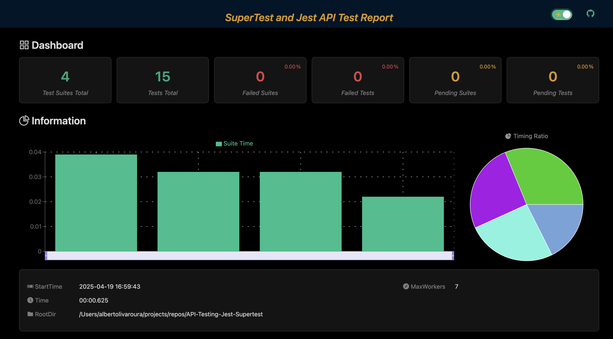

[](https://github.com/olivaalbert1/API-Testing-Jest-Supertest/blob/main/.github/workflows/integration_test.yml)

# API-Testing-Jest-Supertest

This repository contains an example API built with [Express](https://expressjs.com/) and thoroughly tested using [Jest](https://jestjs.io/) and [Supertest](https://github.com/visionmedia/supertest).

## Description

The API provides a basic CRUD (Create, Read, Update, Delete) operations for an entity called 'Product'.

The main goal of this repository is to demonstrate how to build a robust API with Express and how to ensure its correct functionality through integration tests using Jest and Supertest running in a CI/CD github actions. The pipeline runs in every push to main branchs.



## Technologies Used

* **[Node.js](https://nodejs.org/)**: JavaScript runtime environment on the server.
* **[Express](https://expressjs.com/)**: Minimalist and flexible Node.js web application framework.
* **[Jest](https://jestjs.io/)**: JavaScript testing framework with a focus on simplicity and "batteries included".
* **[Supertest](https://github.com/visionmedia/supertest)**: Library for easily testing Node.js HTTP servers.

## Prerequisites

Make sure you have the following installed on your system:

* **[Node.js](https://nodejs.org/)**
* **[npm](https://www.npmjs.com/)** installed with Node.js

## Installation

1.  Clone this repository:
    ```bash
    git clone https://github.com/olivaalbert1/API-Testing-Jest-Supertest
    cd API-Testing-Jest-Supertest
    ```

2.  Install the dependencies using npm or yarn:
    ```bash
    npm install
    ```

## Running the API

To start the development server for the API:

```bash
npm run dev
```

## Running the API integration tests

To start the API integration tests write in the console (it is not necessary server running):

```bash
npm run test

